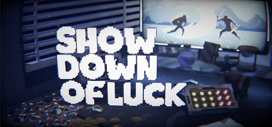

# Godot Voxel Support
[English](https://github.com/QinZhuo/GodotVoxelSupport/blob/main/README.md) | [中文](https://github.com/QinZhuo/GodotVoxelSupport/blob/main/zh/README.md)

[Github](https://github.com/QinZhuo/GodotVoxelSupport) • [Asset Library](https://godotengine.org/asset-library/asset/4480)

> MagicaVoxel large voxel model support, faster import speed, automatic material mapping

- Merge models
- Multi-threaded Mesh generation
- Automatically generate metal, roughness, emissive, and other maps
- Solves the issue of slow import and crashing when importing .vox models larger than 256x256x256

You can see the rendering effects of voxel models imported using this plugin in the game [Showdown of Luck](https://store.steampowered.com/app/4666770/?utm_source=github). It's an indie game I'm currently developing - an asynchronous multiplayer PVP auto-battler that combines cards with slot machines. Feel free to add it to your wishlist if you're interested!

> If your game is using this plugin, I'd be very happy if you could let me know. I'm also willing to help promote it through my channels.

