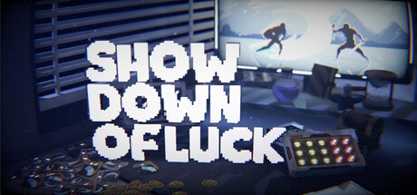

# Godot Voxel Support
[English](https://github.com/QinZhuo/GodotVoxelSupport/blob/main/README.md) | [中文](https://github.com/QinZhuo/GodotVoxelSupport/blob/main/zh/README.md)

[Github](https://github.com/QinZhuo/GodotVoxelSupport) • [Asset Library](https://godotengine.org/asset-library/asset/4480)

> MagicaVoxel large voxel model support, faster import speed, automatic material mapping

- Merge models
- Multi-threaded Mesh generation
- Automatically generate metal, roughness, emissive, and other maps
- Solves the issue of slow import and crashing when importing .vox models larger than 256x256x256



You can see the rendering effects of voxel models imported using this plugin in the game [Showdown of Luck](https://store.steampowered.com/app/4666770/?utm_source=github). It's an indie game I'm currently developing - an asynchronous multiplayer PVP auto-battler that combines cards with slot machines. Feel free to add it to your wishlist if you're interested!

> If your game is using this plugin, I'd be very happy if you could let me know. I'm also willing to help promote it through my channels.


## Voxel Runtime Usage

### Architecture

```
QVoxelSource                    — voxel storage & editing (materials, chunk buffers)
  ├─ VoxelStream (@abstract)     — STORAGE: chunk-level persistence API (all @abstract)
  │    ├─ QVoxelStream             — single-file .qvx block-stream world storage (disk)
  │    └─ VoxelMemoryStream      — memory only (no persistence; a home for edits)
  └─ node: QVoxelNode            — GENERATION: the data layer's single source of truth
       └─ QVoxelModel            — bounded grid + modifier chain (run by QVoxelEvalEngine)
VoxelRenderer              — async mesh generation, LOD, streaming, collision
VoxelDestructible          — extends VoxelRenderer: destruction, collapse, falling debris
```

**Storage and generation are two parallel parts**: `stream` stores (disk or memory), the
`node` describes what to generate (a bounded `QVoxelModel` whose modifier chain the eval
engine runs). They can coexist (procedural world + persisted destruction); lookup order is
always **stream first** — anything stored is authoritative and must never be overwritten by a
freshly generated result.
Pending/ready bookkeeping, dedup, throttling and background dispatch live in one place
(`VoxelAsyncLoader`); each source only answers two synchronous questions: "is it stored?" and
"can you generate it?" (the latter is the virtual `can_generate_chunk()`, which an infinite
world extension overrides).

**Data access order** (per chunk): memory buffer → stream → node.
All mesh generation runs on background threads (`WorkerThreadPool`); the main thread never builds voxel meshes or generates chunks synchronously.

### Static world (disk streaming)

```gdscript
var data := QVoxelSource.new()
# ... add materials, fill voxels (set_voxels / load_voxels_dict)

var stream := QVoxelStream.new()
stream.file_path = "user://my_world/world.qvx"
data.stream = stream

var renderer := VoxelDestructible.new()
renderer.data = data
renderer.voxel_scale = 0.2
renderer.visibility_mode = VoxelRenderer.VisibilityMode.STREAMING
renderer.view_distance = 60.0
renderer.unload_distance = 100.0
renderer.lod_count = 4   # 多级 LOD：4 层（LOD0 全精度 + LOD1/2/3 每级 ×2 粗化），
                         # 各层距离由 view_distance 自动等比（×2）推导
```

### Procedural infinite world

```gdscript
class_name MyWorld
extends QVoxelSource

## Infinite world: declare it, then override the chunk-supply hooks.
func can_generate_chunk(_chunk_key: Vector3i) -> bool:
	return true

## Return a 32³ PackedInt32Array (value = material id, 0 = empty).
## Must be deterministic: same chunk_key → same terrain.
func _generate_chunk(chunk_key: Vector3i) -> PackedInt32Array:
	# e.g. noise-based heightmap — use ABSOLUTE voxel y for cross-layer continuity
	...

# usage: the source GENERATES, the stream STORES (swap freely, independently)
var data := MyWorld.new()
data.infinite = true                      # enables origin shift
data.stream = QVoxelStream.new()          # player edits go to disk, survive restart
data.stream.file_path = "user://world_edits/world.qvx"
# assign to VoxelRenderer.data (recommend visibility_mode = STREAMING)
```

> Swap `stream` for `VoxelMemoryStream` to keep edits in memory only; leave it unset and the
> engine falls back to a memory stream automatically. The generation code never changes.

Features:
- **Deterministic** — same chunk_key → same terrain, continuous across borders and origin shifts
- **Origin shift** — camera moving far auto-shifts the world origin so coordinates stay small (float32 precision safe) → truly unlimited world
- **Edit persistence** — player-modified chunks are stored by `stream`, surviving restart
- **Async generation** — chunk generation runs on background threads; main thread only submits/collects
- **Auto-unload** — meshes, LOD0 chunk data and coarse LOD blocks beyond distance are all dropped
  and rebuilt on return. LOD0 *data* is unloaded on a wider radius than meshes (`unload_distance`
  plus the coarsest block's extent) so coarse downsampling keeps its LOD0 source; everything is
  re-loaded / re-generated on return — this is what keeps an infinite world's memory bounded

### Destruction & collapse

```gdscript
var target := renderer as VoxelDestructible
target.damage_sphere(center, radius)
target.damage_voxel(pos)
target.damage_ray(origin, direction, max_distance)
```

Options: `use_voxel_health` / `damage_per_voxel` / `collapse_mode` / `local_collapse` /
`falling_mode` / `stress_force` / `spawn_debris_on_damage`, etc.
Debris is GPU-particle based (no per-chunk physics bodies).

### Configuration — auto-hidden when not applicable

Related properties are **hidden in the Inspector automatically** when they have no effect:

| Property | Effective when | Hidden when |
|---|---|---|
| `view_distance` / `unload_distance` / `lod_count` | visibility_mode ≠ FULL | visibility_mode = FULL |
| `_stream_load_per_frame` / `_stream_unload_per_frame` | visibility_mode = STREAMING | otherwise |
| `_lod1_build_per_frame` / `_lod1_build_budget_ms` | lod_count > 1 | lod_count = 1 |
| `_collision_rebuild_per_frame` | generate_collision = true | generate_collision = false |
| `max_debris_per_hit` / `debris_*` | spawn_debris_on_damage = true | spawn_debris_on_damage = false |

### Common pitfalls

- **Procedural world**: use `visibility_mode = STREAMING` — infinite worlds are always distance-driven (FULL/FRUSTUM previously rendered nothing; now auto-fixed)
- `lod_count = 1` disables LOD (everything full-precision); for large worlds set `lod_count >= 2`.
  Band radii are automatic: LOD0 = `view_distance / 2^lod_count`, LOD_i (i>=1) =
  `view_distance / 2^(lod_count-1-i)` — each level doubles, matching Voxel Tools.
- `unload_distance = 0` falls back to `view_distance * 1.2`
- `generate_collision` is **false by default** — enable it for physics collision
- `voxel_scale` = world units per voxel (data coordinates are 1-voxel units); all distances are in world units
- **The native library is a hard dependency** — mesh generation, destruction and CRC all live in
  `addons/VoxelSupport/Native/` (GDExtension `VoxelNative`). If it is missing or version-mismatched,
  the plugin logs one clear error and draws nothing; there is no GDScript fallback.
- **Asset origin is one shared import option: `mesh/origin`** — default `world_origin` = keep the file's
  coordinates: a `.vox` stays where the author put it in the MagicaVoxel world (model `SIZE`-box centre
  plus every `nTRN`/`NODE` transform), and a `.qvx` — which has no world layer — simply uses its stored
  coordinates as-is. This is also what the Mesh import always did, so upgrading never shifts existing
  assets and multi-model assemblies keep their relative layout. The Mesh and the Voxel Data importer
  read the same option with the same meaning, so a model lands in the same spot either way. Pick
  `bottom_center` for the usual game-asset pivot (X/Z centred on the content, bottom at `Y = 0`), or
  `content_center` for a three-axis content-centred origin (the same idea as Blender's
  "Center Origins" option).
- **`.vox` and `.qvx` have separate asset adapters** — `.vox` (MagicaVoxel scene graph) uses
  `VoxAsset.from_asset()`; `.qvx` (one `VXEL` per model + `NODE` placement) uses
  `QVoxelAsset.from_file()`. `VoxAsset.from_asset()` on a `.qvx` **returns null with an error**:
  forcing the MagicaVoxel shape onto QVX silently dropped the `NODE` graph and every model after
  the first. The import plugins dispatch by extension for you.

### Streaming demo

`res://demo/streaming_demo.tscn` — **key 0** switches between disk-file stream and procedural infinite world.
Controls: WASD move, Q/E up/down, Space fast, 1 streaming on/off, 2 frustum culling on/off.
